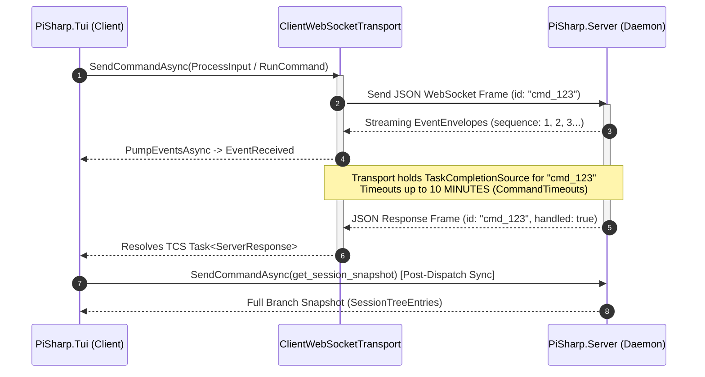
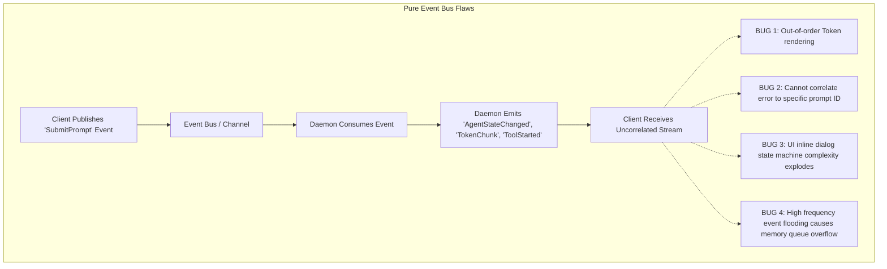

# Architectural Analysis: CLI/TUI & Daemon Communication Strategy

> [!NOTE]
> **Executive Summary & Key Takeaway**
> The current CLI/TUI <-> Daemon communication relies on **Request-Response RPC over WebSockets** (`SendCommandAsync` with TaskCompletionSource timeouts up to 10 minutes), coupled with post-dispatch snapshot hydration (`get_session_snapshot`) and synchronous UI-bridge callbacks (`ui_request` / `ui_response`).
> 
> **Is a pure Event Bus better?** **No, a pure Event Bus is NOT recommended.** Replacing RPC entirely with an unconstrained Event Bus introduces severe new failure modes (correlation breakdown, out-of-order state rendering, split-brain UI state, backpressure collapse, and non-deterministic debugging). 
> 
> **What IS better?** A **Hybrid CQRS + Reactive Channel Architecture**:
> 1. **Commands (CQRS Command Side)**: Async Non-Blocking Command Handshakes (Return immediate `JobAccepted` with command token instead of holding a 10-minute HTTP/WS socket `await`).
> 2. **Events (CQRS Query/Stream Side)**: Monotonically sequenced, append-only Event Channel (`SequenceId`) powering a client-side delta reducer (`ClientEventReducer`), eliminating post-command `get_session_snapshot` polling.
> 3. **UI Handshake**: Dedicated request-reply lease protocol with explicit cancellation tokens and auto-release.

---

## 1. System Decomposition: The Status Quo ("Await-Heavy" Model)

In PiSharp's current architecture (`PiSharp.Cli`, `PiSharp.Tui`, `PiSharp.Client`, `PiSharp.Server`), the CLI/TUI host communicates with the background daemon over a WebSocket transport.



### Current Wiring Highlights:
* **RPC Correlation via TCS**: `ClientWebSocketTransport.cs` maintains a `ConcurrentDictionary<string, TaskCompletionSource<ServerResponse>> _pending`. Commands wait synchronously (up to 10 minutes for `run_command` and `process_input`, 90 seconds for session creation) via `WaitAsync(linked.Token)`.
* **Synchronous UI-Bridge Callback**: `ServerUiBridge.cs` sends a flat `ui_request` envelope over the session event lane and blocks daemon execution awaiting a `ui_response` payload or timeout.
* **Post-Command Snapshot Sync**: After commands execute in `TuiCommandController`, the client issues a `get_session_snapshot` RPC call to pull the full branch state from the daemon to sync history.

---

## 2. Adversarial Breakdown #1: Vulnerabilities of the Current RPC Model

Below is an aggressive failure-mode analysis of the existing RPC/await-heavy approach.

### 🔴 Failure Mode A: Long-Poll Socket Timeouts & Ghost Operations
* **Mechanism**: When a long-running agent command (`process_input` or `/tools`) exceeds the client timeout (e.g. 10 minutes) or encounters a network blip, `ClientWebSocketTransport` throws an `OperationCanceledException` and returns a fake `timeout` response to the TUI.
* **Adversarial Vector**: The daemon **continues running the operation in the background**. The operation is now a "ghost operation"—emitting events for a command the client considers failed. If the client sends a follow-up command, both commands execute concurrently on the daemon, corrupting session turn order.
* **Code Reference**: [ClientWebSocketTransport.cs](file:///G:/code/AI/pi/PiSharp/src/PiSharp.Client/ClientWebSocketTransport.cs#L122-L137)

### 🔴 Failure Mode B: Post-Dispatch Snapshot Refetch Overhead & Race Conditions
* **Mechanism**: After every slash command or tool execution, the client calls `get_session_snapshot` to sync transcript entries.
* **Adversarial Vector**: 
  1. Transferring entire branch trees (JSON blobs with message structures) after every command creates unnecessary CPU and network serialization overhead ($O(N)$ growth per turn).
  2. If an async event arrives *during* snapshot deserialization, local state can overwrite incoming delta events, causing visual jumps or missing stream lines in the UI.
* **Code Reference**: [RemoteTuiBackend.cs](file:///G:/code/AI/pi/PiSharp/src/PiSharp.Client/RemoteTuiBackend.cs#L416-L420) & [docs/pisharp-remote-tui-model-switch.md](file:///G:/code/AI/pi/PiSharp/docs/pisharp-remote-tui-model-switch.md#L17-L44)

### 🔴 Failure Mode C: Starvation & Inbound Pump Lockups via Synchronous UI Requests
* **Mechanism**: When the daemon requests inline selection (e.g. `/model` picker), it emits a `ui_request`. The client processes events on an event pump.
* **Adversarial Vector**: If the UI request handler blocks the event processing loop, incoming stream tokens from other subagents or background tasks are stalled behind the prompt. (While recently mitigated with per-request linked CTS off-pump execution in `RemoteTuiBackend.cs`, the fundamental model still relies on holding open wait handles across the wire).
* **Code Reference**: [ServerUiBridge.cs](file:///G:/code/AI/pi/PiSharp/src/PiSharp.Server/UiBridge/ServerUiBridge.cs#L45-L50)

---

## 3. Adversarial Breakdown #2: Pitfalls of a "Pure Event Bus" Alternative

A common proposal is to replace RPC calls with a pure, unconstrained Event Bus (Pub/Sub message bus). Below is an adversarial critique demonstrating why a pure Event Bus introduces even more dangerous failure modes.



### 🔴 Flaw #1: Loss of Explicit Command Correlation
* **The Problem**: In pure Pub/Sub, a client emits `PromptSubmitted(text)` and listens for generic `AgentUpdated` events.
* **Failure Scenario**: If the user submits two rapid prompts or slash commands (e.g., `/model` then `/help`), events arrive asynchronously. Without strict command-response futures, the UI cannot determine which command produced an error or output.

### 🔴 Flaw #2: Split-Brain UI & Missing Ordering Guarantees
* **The Problem**: Event buses default to asynchronous fan-out dispatch.
* **Failure Scenario**: A `ToolCompleted` event might be processed by the TUI rendering thread *before* the corresponding `ToolStarted` event due to thread pool scheduling. The TUI crashes or renders negative duration metrics because state transitions arrived out-of-order.

### 🔴 Flaw #3: High-Frequency Event Flooding & Backpressure Collapse
* **The Problem**: LLM streaming produces 50-100 token events per second per active agent.
* **Failure Scenario**: A naive Event Bus queues thousands of `TokenEvent` instances. If the Terminal.GUI main thread (`Application.MainLoop`) is busy redrawing or handling user input, the in-memory event queue swells rapidly, leading to memory bloat and latency lag where the UI updates seconds *after* the daemon finished generating.

### 🔴 Flaw #4: Complexity Explosion for Interactive Handshakes
* **The Problem**: UI interactions like `/model` selection or permission approvals require request-reply semantics (`RequestUi` -> `UserResponse`).
* **Failure Scenario**: Modeling a dialog as raw decoupled events requires managing a complex state machine (e.g. `UiDialogRequested`, `UiDialogRendered`, `UiOptionSelected`, `UiDialogCancelled`, `UiDialogTimedOut`) with explicit timeout timers on *both* sides, greatly increasing bug surface area.

---

## 4. Architectural Comparison Table

| Attribute | Status Quo (RPC WebSocket) | Pure Event Bus (Pub/Sub) | **Recommended Hybrid (CQRS + Channels)** |
| :--- | :--- | :--- | :--- |
| **Command Delivery** | Synchronous await (10-min block) | Fire-and-Forget | Non-blocking Async Handshake (`Ack`) |
| **Correlation** | Direct (`TaskCompletionSource`) | Weak / Custom Correlation IDs | Explicit (`CommandId` -> `CommandAck`) |
| **State Sync** | Full snapshot poll (`get_session_snapshot`) | Event Replay | Monotonic Sequence Log (`SequenceId` Reducer) |
| **UI Handshakes** | Synchronous `ui_request` / `ui_response` | Event-driven state machines | Structured Request-Reply Lease |
| **Backpressure Control** | Implicit (Socket TCP flow control) | Poor (Risk of channel explosion) | Explicit (`BoundedChannel` with Coalescing) |
| **Network Resilience** | Poor (Long timeout socket drops) | High (Asynchronous delivery) | High (Replay from `SequenceId` watermark) |
| **Debuggability** | High (Clear async stack trace) | Low (Distributed stack trace nightmare) | High (Traced Command/Event logs) |

---

## 5. Target Blueprint: The Hybrid CQRS + Reactive Channel Architecture

Instead of choosing between rigid RPC and chaotic Event Bus, PiSharp should adopt a **CQRS (Command Query Responsibility Segregation) + Monotonic Event Channel** model.

```mermaid
flowchart LR
    subgraph Client [PiSharp.Tui / Client]
        CmdController[TUI Command Controller]
        StateReducer[ClientEventReducer]
        TuiUI[Terminal.GUI Views]
    end

    subgraph Transport [WebSocket Transport Layer]
        CmdChannel[Command Channel\n(Async Non-blocking)]
        EventStream[Monotonic Event Stream\n(SequenceId Bounded Channel)]
    end

    subgraph Daemon [PiSharp.Server / Runtime]
        CmdDispatcher[Command Dispatcher]
        EventBusHost[Event Bus / Sequence Store]
        AgentEngine[Agent Harness / SessionRuntime]
    end

    CmdController -->|1. Submit Command (Returns Ack immediately)| CmdChannel
    CmdChannel --> CmdDispatcher
    CmdDispatcher -->|2. Enqueue Job| AgentEngine

    AgentEngine -->|3. Publish Event (Seq: 101)| EventBusHost
    EventBusHost -->|4. Push Monotonic Stream| EventStream
    EventStream -->|5. Apply Delta Event| StateReducer
    StateReducer -->|6. Trigger UI Redraw| TuiUI
```

### Core Architecture Components:

1. **Async Command Handshake (Non-Blocking Commands)**:
   * Client sends command (e.g. `process_input`).
   * Daemon immediately returns a lightweight `CommandAck` carrying `{ commandId: "cmd_456", status: "Enqueued" }` in **< 10ms**.
   * Client does **NOT** block `await`ing job execution. It tracks `cmd_456` in local active operations.

2. **Monotonically Sequenced Event Stream**:
   * Daemon assigns every emitted event a strictly increasing `SequenceId` (e.g., 101, 102, 103).
   * Events flow continuously down an unbounded/bounded channel to the client.
   * Client's `ClientEventReducer` updates local `ClientSessionState` strictly in sequence.
   * **No post-command `get_session_snapshot` needed**: If a gap is detected (e.g., received sequence 105 when expecting 103), client requests delta `replay_events(fromSequence: 103)`.

3. **Bounded Token Coalescing for UI Rendering**:
   * To prevent UI thread freezing during rapid token generation, token streaming events (`content_delta`) pass through a bounded channel on the client with a 16ms (60 FPS) batch coalescing window before pushing to Terminal.GUI.

---

## 6. Phased Refactoring Strategy (Non-Breaking Migration)

If PiSharp decides to modernize this layer in the future, the following step-by-step migration plan preserves existing contracts:

### Phase 1: Eliminate Post-Dispatch Snapshot Refetching
* **Action**: Upgrade `ClientEventReducer` to achieve 100% delta coverage for all harness events (`model_change`, `thinking_change`, `tool_call`, `compaction`).
* **Result**: Remove `get_session_snapshot` from `TuiCommandController` after command completion, instantly eliminating $O(N)$ bandwidth overhead and snapshot exceptions.

### Phase 2: Decouple Command Execution from Transport Timeouts
* **Action**: Introduce `CommandAck` response frame type. Update daemon to acknowledge command reception immediately and publish execution status via the event stream (`command_started`, `command_completed`, `command_failed`).
* **Result**: Eliminates 10-minute long-poll WebSocket `await` calls and ghost operation bugs.

### Phase 3: Add Sequence Gap Recovery & Replay
* **Action**: Store last 1000 events in daemon ring buffer (`EventStore`). Add `reconnect(lastSequenceId)` handshake.
* **Result**: Complete immunity to transient WebSocket disconnects and network blips without losing UI state.

---

## 7. Verification & Design Guidelines

When evaluating future TUI/Daemon communication PRs, enforce these rules:

1. **No Long-Poll RPC Calls**: No WebSocket command timeout should exceed 15 seconds. Long tasks must use async job tracking.
2. **Zero Full-Snapshot Polls in Hot Paths**: Snapshots should only be fetched once on initial session connection/attach, never in post-command loops.
3. **Sequence Parity**: All events must carry a 64-bit monotonically increasing sequence number per session.
